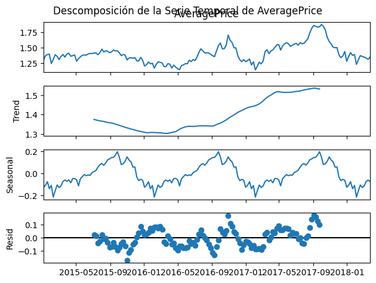
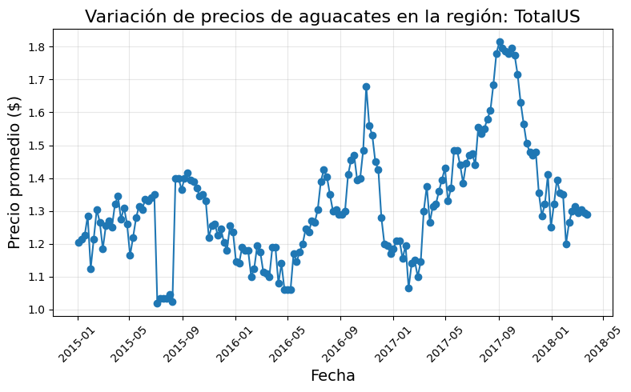
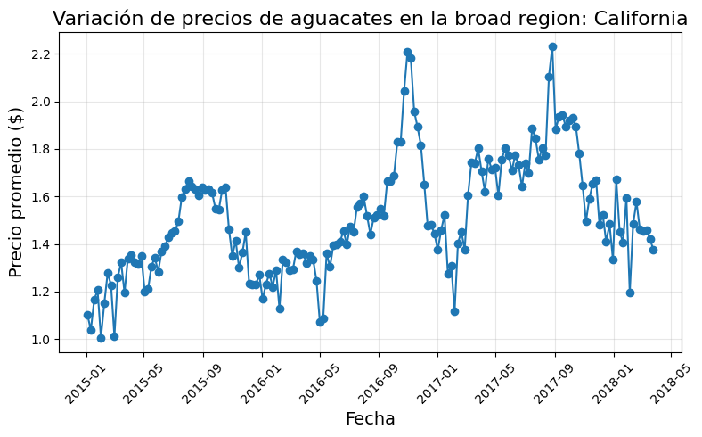
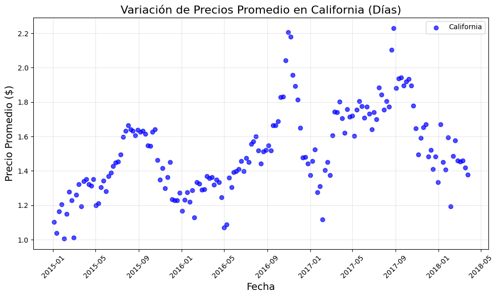
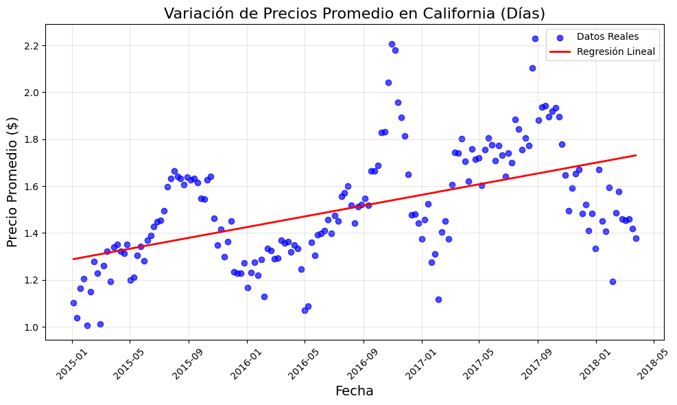
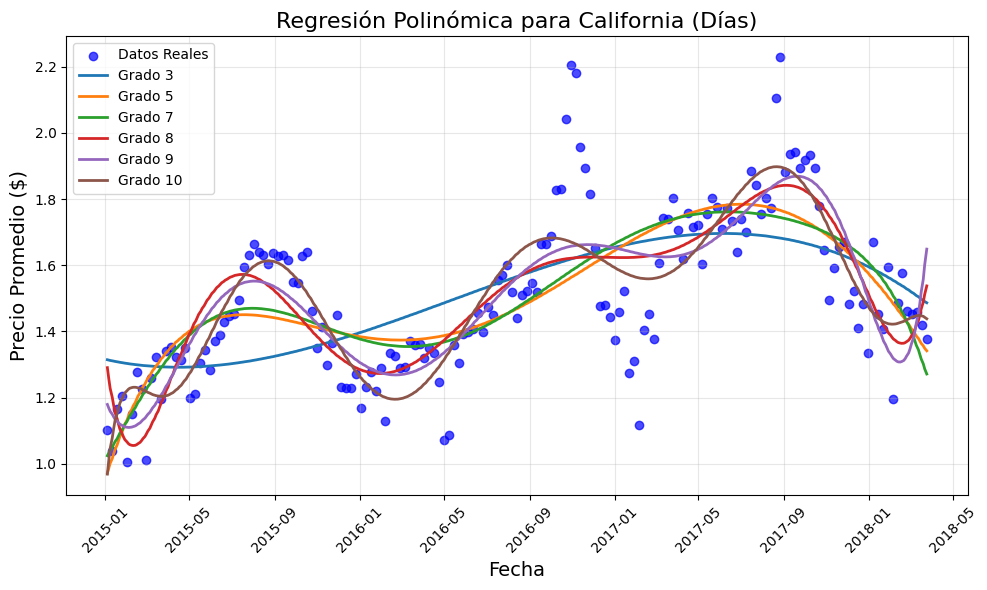
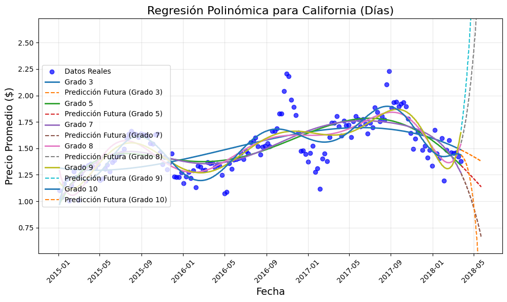

# Avocado Proyect

Avocado
Carmen RAMÍREZ
regresion lineal
Hemos creado gráficos de dispersión agrupadas por broad regions. Las broad regions hemos agrupado cada ciudad en regiones de EEUU. Saco los graficos de dispersión del trabajo previo hecho en 1 y 2

Descomposición de Series Temporales de Precios:
Uso de Datos: Usa la columna AveragePrice y Date.
Esperado: Utiliza la función seasonal_decompose de la librería statsmodels para descomponer la serie temporal de precios en componentes de tendencia, estacionalidad y ruido.
Convierte Date a tipo datetime usando pd.to_datetime().
Agrupa los datos por Date y calcula el promedio de AveragePrice utilizando groupby() si es necesario.
Visualiza los componentes descompuestos usando matplotlib para cada uno de ellos.
series temporales

FUENTES: MIRAR APUNTES ANALISIS EXPLORATORIO DE DATOS- TEORIA 4 Mirar punto 9. (pagina 45 )

Análisis de Estacionalidad por Región:
Uso de Datos: Usa las columnas AveragePrice, Date y Total Volume.
Esperado: Utiliza gráficos de líneas para visualizar cómo varían los precios de aguacates por región a lo largo de diferentes estaciones del año.
Agrupa los datos por region y Date utilizando groupby().
Calcula el promedio de AveragePrice para cada región.
Representa gráficamente las tendencias utilizando plt.plot() de matplotlib.
pero centrado en 'AveragePrice'.

Ejemplo de un grafico creado

analisis estacionalidad region US

El total de regiones són ['Albany' 'Atlanta' 'BaltimoreWashington' 'Boise' 'Boston' 'BuffaloRochester' 'California' 'Charlotte' 'Chicago' 'CincinnatiDayton' 'Columbus' 'DallasFtWorth' 'Denver' 'Detroit' 'GrandRapids' 'GreatLakes' 'HarrisburgScranton' 'HartfordSpringfield' 'Houston' 'Indianapolis' 'Jacksonville' 'LasVegas' 'LosAngeles' 'Louisville' 'MiamiFtLauderdale' 'Midsouth' 'Nashville' 'NewOrleansMobile' 'NewYork' 'Northeast' 'NorthernNewEngland' 'Orlando' 'Philadelphia' 'PhoenixTucson' 'Pittsburgh' 'Plains' 'Portland' 'RaleighGreensboro' 'RichmondNorfolk' 'Roanoke' 'Sacramento' 'SanDiego' 'SanFrancisco' 'Seattle' 'SouthCarolina' 'SouthCentral' 'Southeast' 'Spokane' 'StLouis' 'Syracuse' 'Tampa' 'TotalUS' 'West' 'WestTexNewMexico']

Arriba son demasiadas regiones así que las agrupamos como sigue

3. Mapeo de Regiones
region_to_broad = { # California 'LosAngeles': 'California', 'SanDiego': 'California', 'SanFrancisco': 'California', 'Sacramento': 'California',

# Great Lakes
'Chicago': 'GreatLakes',
'Detroit': 'GreatLakes',
'Cleveland': 'GreatLakes',
'BuffaloRochester': 'GreatLakes',
'GrandRapids': 'GreatLakes',

# Midsouth
'Nashville': 'Midsouth',
'Louisville': 'Midsouth',
'CincinnatiDayton': 'Midsouth',
'Indianapolis': 'Midsouth',
'Columbus': 'Midsouth',

# Northeast
'NewYork': 'Northeast',
'Boston': 'Northeast',
'Philadelphia': 'Northeast',
'HartfordSpringfield': 'Northeast',
'HarrisburgScranton': 'Northeast',
'Syracuse': 'Northeast',
'Pittsburgh': 'Northeast',

# Northern New England
'NorthernNewEngland': 'NorthernNewEngland',

# South Carolina
'SouthCarolina': 'SouthCarolina',

# South Central
'DallasFtWorth': 'SouthCentral',
'Houston': 'SouthCentral',
'NewOrleansMobile': 'SouthCentral',
'SouthCentral': 'SouthCentral',

# Southeast
'Atlanta': 'Southeast',
'Charlotte': 'Southeast',
'RaleighGreensboro': 'Southeast',
'Jacksonville': 'Southeast',
'Tampa': 'Southeast',
'MiamiFtLauderdale': 'Southeast',
'Orlando': 'Southeast',

# West
'Seattle': 'West',
'Portland': 'West',
'Spokane': 'West',
'LasVegas': 'West',
'PhoenixTucson': 'West',
'West': 'West',

# West Texas/New Mexico
'WestTexNewMexico': 'WestTexNewMexicoEstate',
'ElPaso': 'WestTexNewMexico',
'Albany': 'Northeast', 
'BaltimoreWashington': 'Northeast', 
'Boise': 'West', 
'Denver': 'West',  
'RichmondNorfolk': 'Southeast',
'Roanoke': 'Southeast', 
'Plains': 'Midsouth',  
'StLouis': 'Midsouth', 

# BROAD REGIONS (SEPARADO)
'California': 'CaliforniaEstate',  
'GreatLakes': 'GreatLakesEstate', 
'Midsouth': 'MidsouthEstate',  
'Northeast': 'NortheastEstate',  
'SouthCentral': 'SouthCentralEstate',  
'Southeast': 'SoutheastEstate',
'TotalUS':'TotalUS'
}

Y hacemos graficos por regiones

California Region

GRAFICO DE DISPERSIÓN FINAL
Pero nos hace falta un gráfico de dispersión y creamos un dataframe agrupado. Probamos en diferentes escalas temporales y nos quedamos en días. Ejemplo código

grouped_data = advocado_data.groupby(['broad_region', pd.Grouper(key='Date', freq='D')]).agg(AveragePrice=('AveragePrice', 'mean') ).reset_index()

Obtenemos

California Region Grafico dispersión

De esta manera podemos entrenar modelos como regresiones (lineales o polinómicas) para prever precios.

MODELOS REGRESIÓN LINEAL Y POLINÓMICA
MODELO REGRESIÓN LINEAL
Obtenemos

California Regresión Lineal

Para ello usamos

Uso de la ingeniería de características
La ingeniería de características consiste en transformar los datos originales para crear nuevas variables (características) o mejorar las existentes, con el objetivo de optimizar el rendimiento de los modelos de aprendizaje automático.

Transformación de variables (numéricas, categóricas, etc.).
Escalado y normalización.
Aplicar funciones matemáticas como logaritmos, polinomios, etc.
En este codígo el problema es que hay variables de fechas que són variables temporales no numérica, que se soluciona conviertiendo en una variable numérica que el modelo puede usar.

advocado_data['Date_Num'] = advocado_data['Date'].map(pd.Timestamp.toordinal)

REGRESIÓN POLINÓMICA DE DISTINTO GRADO POR ZONAS
Ejemplo de regresión polinómica aplicado a California de nuevo

California Regresión Polinomica

Uso de StandardScaler
Variables como fechas convertidas a números (Date_Num) pueden tener valores grandes (ej. 737425). Al elevar estos valores a potencias altas (polinomios), los números se vuelven enormes y desbalanceados, lo que dificulta el ajuste del modelo.

StandardScaler

Paso 1 - Calcular media y desviación estándar:Media = 737426, desviación = 1.

Paso 2 - Aplicar StandardScaler:

Date_Num (original) 737425

Date_Num (escalado) -1

Ahora, al aplicar regresión polinómica, se trabaja con valores centrados y pequeños en lugar de números grandes como 737425.

Métricas de evaluación:
RMSE (Error Cuadrático Medio): Mide el error promedio del modelo. Cuanto más bajo es el RMSE, mejor es la capacidad del modelo para predecir los valores de la variable objetivo. R² (Coeficiente de Determinación): Indica qué porcentaje de la variabilidad de la variable dependiente puede explicar el modelo. Un valor más cercano a 1 significa un ajuste mejor.

EJEMPLO METRICAS PARA CALIFORNIA

Grado 3 - RMSE: 0.19, R²: 0.36 Grado 5 - RMSE: 0.17, R²: 0.51 Grado 7 - RMSE: 0.17, R²: 0.51 Grado 8 - RMSE: 0.15, R²: 0.62 Grado 9 - RMSE: 0.15, R²: 0.64 Grado 10 - RMSE: 0.13, R²: 0.71

Resultados: Mejor RMSE en grado 10: 0.1326 Mejor R2 en grado 10: 0.7054

Explicación
A medida que el grado polinómico aumenta, el modelo mejora su ajuste a los datos (menor RMSE, mayor R²).

Sin embargo, un grado demasiado alto puede llevar a sobreajuste: el modelo se adapta demasiado a los datos de entrenamiento y pierde capacidad de generalización.

COMPARACIÓN MÉTRICAS MODELO LINEAL Y POLINÓMICO
Comparando las metricas del modelo lineal sobre california

Analisis Regresión sobre California - RMSE: 0.21, R²: 0.28

Y las mejores métricas del modelo polinómico

Resultados: Mejor RMSE en grado 10: 0.1326 Mejor R2 en grado 10: 0.7054

Vemos que es mejor usar el modelo polinómico al lineal.

EXTRAPOLACION
Para la extrapolación se aplica el mismo modelo pero se extiende las fechas para fer como funciona el modelo.

California Regresión Polinomica extendida

Esto muestra que la regresión polinómica no es válida para extrapolar porque fuera del rango de los datos:

El modelo puede volverse inestable y producir predicciones irreales debido al crecimiento exagerado de términos. El sobreajuste amplifica errores y ruido, afectando la generalización. Los coeficientes grandes y la naturaleza oscilante de polinomios de grados altos generan comportamientos extremos y poco realistas. Es mejor usar la regresión polinómica solo para interpolación y optar por otros modelos para extrapolar.
